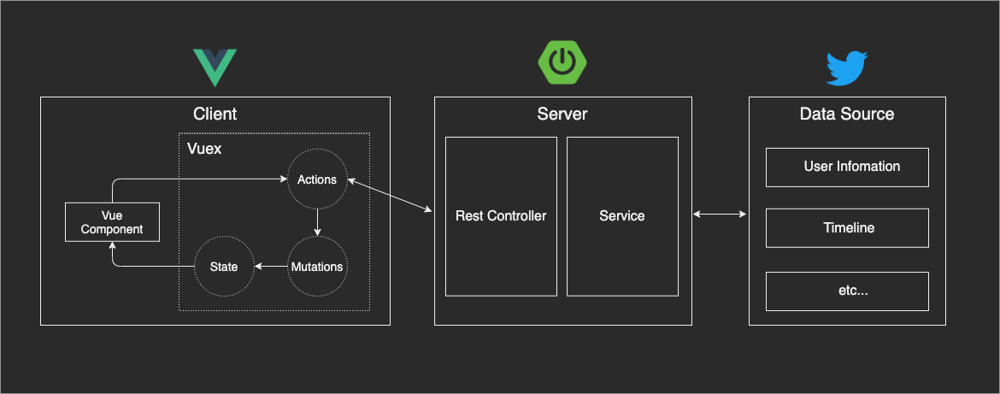

# Visutter
[Visutter](https://visutter.azurewebsites.net/)は、Tweet情報をダッシュボード形式で可視化するアプリケーションです。

ユーザー情報に基づくTweetを取得することで、以下の情報を表示します。
- 合計ツイート数
- 最大いいね数
- 最大リツイート数
- 最長連続ツイート日数
- 現在の連続ツイート日数
- 累計ツイート日数
- 1日の最大ツイート数

https://visutter.azurewebsites.net/


## Usage
### Prerequisites
開発マシンに以下の前提条件がすべてインストールされていることを確認してください。
- Git - [Download & Install Git](https://git-scm.com/downloads). MacOSとLinuxには初期状態でインストールされています。
- Node.js - [Download & Install Node.js](https://nodejs.org/en/download/).
- JDK - [Download & Install OpenJDK](https://adoptopenjdk.net/). (好みのJDKで構いません)
- Maven - [Downloading Apache Maven](https://maven.apache.org/download.cgi).

### Installation
1. TwitterAPIのKey&Tokenの取得

    [Twitter Developer](https://developer.twitter.com/en/apply-for-access)から登録および申請を行い、APIKeyとTokenを取得してください。

2. レポジトリのクローン

    ```bash
    $ git clone https://github.com/kooooichi24/Visutter.git
    ```

3. npmパッケージのインストール

    ```bash
    $ cd Visutter/frontend
    $ npm install
    ```

4. Mavenライブラリのインストール

    ```bash
    $ cd ../backend
    $ mvn install
    ```

5. TwitterAPIのKeyとToken情報を入力

    プロパティファイルの作成
    ```bash
    $ cd ./src/main/resources
    $ touch twitter4j.properties
    ```

    プロパティファイルに情報を入力
    ```properties
    debug=true
    oauth.consumerKey=PLEASE
    oauth.consumerSecret=ENTER
    oauth.accessToken=YOUR
    oauth.accessTokenSecret=KEYANDTOKEN
    ```

### Run Application
1. backend

    ```bash
    $ mvn spring-boot:run
    ```

2. frontend

    ```bash
    $ npm run serve
    ```

## Architecture


## Technologies
- Vue.js 2系
- TypeScript 3系
- vuex 3系
- vuetify 2系
- SpringBoot 2系
- Docker
- Microsoft Azure

## Contributing
1. Fork the Project
2. Create your Feature Branch (git checkout -b feature/AmazingFeature)
3. Commit your Changes (git commit -m 'Add some AmazingFeature')
4. Push to the Branch (git push origin feature/AmazingFeature)
5. Open a Pull Request