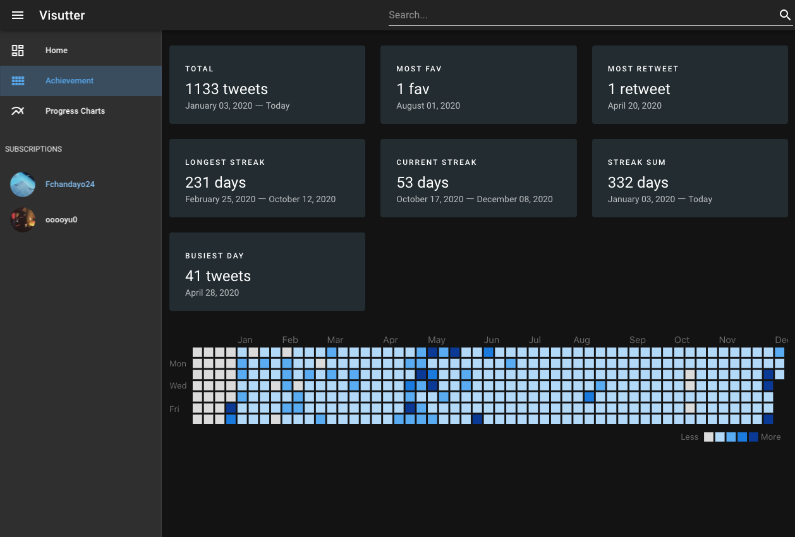

# Visutter
Visutterは、Tweet情報をダッシュボード形式で可視化するアプリケーションです。

ユーザー情報に基づくTweetを取得することで、以下の情報が表示します。
- 合計ツイート数
- 最大いいね数
- 最大リツイート数
- 最長連続ツイート日数
- 現在の連続ツイート日数
- 累計ツイート日数
- 1日の最大ツイート数

## About The Project

### Built With

## Getting Started

### Prerequisites

### Installation

## Usage

## Roadmap

## Roadmap

## License

## Contact

## サービス概要

## モチベーション
## 起動手順

## 使用技術